参考了https://github.com/yangguangchao/Operation-Class001/tree/main/week21，非常感谢！

# 0. 服务器配置
| 服务器名      | IP |
| ----------- | ----------- |
| k8s-master    | 172.31.7.101 |
| k8s-node01    | 172.31.7.111 |
| k8s-node02    | 172.31.7.112 |
| k8s-node03    | 172.31.7.113 |
| server    | 172.31.7.109 |
| mall-middleware    | 172.31.7.118 |
mall-middleware是编译和docker的部署服务器。
mall的k8s服务，以及Promethes和nodeexporter部署在k8s上。
Server主要用于放harbor和nfs。

# 1. 部署 mall-swarm 项目所需要的 MySQL、Redis、RabbitMQ、Nacos 等中间件
## 1.1 中间件部署
```bash
## 克隆代码
root@mall-middleware:~# mkdir mall
root@mall-middleware:~# cd mall/
root@mall-middleware:~/mall# git clone https://github.com/macrozheng/mall-swarm.git
## 拷贝中间件的部署文件
root@mall-middleware:~# mkdir ~/middware
root@mall-middleware:~# cd !$
root@mall-middleware:~/middware# cp /root/mall/mall-swarm/document/docker/docker-compose-env.yml docker-compose.yml
root@mall-middleware:~/middware# cp /root/mall/mall-swarm/document/docker/nginx.conf nginx.conf
root@mall-middleware:~/middware# cp ../mall/mall-swarm/document/elk/logstash.conf .
## 创建mysql数据目录
root@mall-middleware:~# mkdir -pv /mydata/mysql/data/db
## 创建redis数据目录
root@mall-middleware:~# mkdir -pv /mydata/redis/data
## 创建nginx数据目录
root@mall-middleware:~# mkdir -pv /mydata/nginx/html /mydata/nginx/log
## 创建rabbitmq数据目录并修改权限
root@mall-middleware:~# mkdir -pv /mydata/rabbitmq/data
## 创建elasticsearch目录并修改权限
root@mall-middleware:~# mkdir -pv /mydata/elasticsearch/plugins /mydata/elasticsearch/data
root@mall-middleware:~# chown -R 777 /mydata/elasticsearch
## 创建MongoDB数据目录
root@mall-middleware:~# mkdir -pv /mydata/mongo/db
## 修改docker-compose文件，增加nacos的内容,修改后的文件见middleware/docker-compose.yml
root@mall-middleware:~/middware# vi docker-compose.yml
  nacos-registry:
    image: nacos/nacos-server:v2.1.0
    container_name: nacos-registry
    environment:
      - "MODE=standalone"
    ports:
      - 8848:8848
## 拉取镜像
root@mall-middleware:~/middware# docker compose pull
## 启动中间件服务
root@mall-middleware:~/middware# docker compose up -d
## 查看服务状态
root@mall-middleware:~/middware# docker compose ps
```
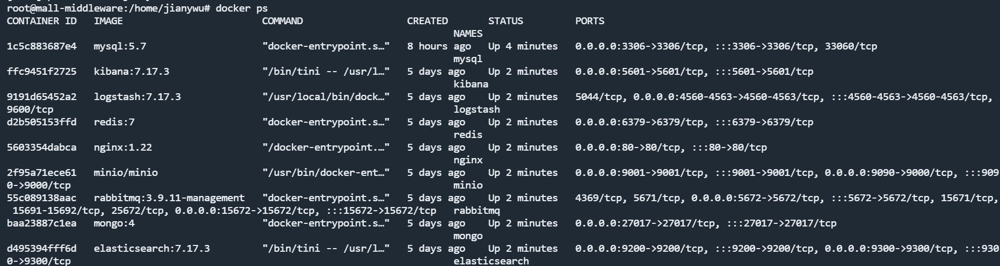

## 1.2 中间件初始化
### 1.2.2 myql初始化
```bash
## 将 sql 文件拷贝到 mysql 容器根目录
root@mall-middleware:~# docker cp mall/mall-swarm/document/sql/mall.sql mysql:/
## 进入 mysql 容器
root@mall-middleware:~# docker exec -it mysql /bin/bash
## 连接mysql
bash-4.2# mysql -uroot -proot --default-character-set=utf8
## 创建远程访问用户
mysql> grant all privileges on *.* to 'reader' @'%' identified by '123456';
Query OK, 0 rows affected, 1 warning (0.00 sec)
## 创建 mall 数据库
mysql> create database mall character set utf8;
## 使用 mall 数据库
mysql> use mall;
## 导入 mall.sql 脚本
mysql> source /mall.sql;
## 查看创建的数据库表
mysql> show tables;
+-----------------------------------------+
| Tables_in_mall                          |
+-----------------------------------------+
| cms_help                                |
| cms_help_category                       |
| cms_member_report                       |
........
| ums_resource_category                   |
| ums_role                                |
| ums_role_menu_relation                  |
| ums_role_permission_relation            |
| ums_role_resource_relation              |
+-----------------------------------------+
76 rows in set (0.00 sec)
## master节点连接测试
root@k8s-master1:~# mysql -uroot -proot -h172.31.7.118
```

### 1.2.2 elasticsearch初始化
* 需要安装中文分词器 IKAnalyzer，mall-swarm 项目会用，并重新启动。
* 注意下载与 Elasticsearch 对应的版本，下载地址: https://github.com/medcl/elasticsearch-analysis-ik/releases
```bash
## 下载插件
root@mall-middleware:~# cd /mydata/elasticsearch/plugins
root@mall-middleware:/mydata/elasticsearch/plugins# wget https://github.com/medcl/elasticsearch-analysis-ik/releases/download/v7.17.3/elasticsearch-analysis-ik-7.17.3.zip
## 解压压缩包
root@mall-middleware:/mydata/elasticsearch/plugins# unzip elasticsearch-analysis-ik-7.17.3.zip -d analysis-ik
## 移除不需要的压缩包
root@mall-middleware:/mydata/elasticsearch/plugins# mv elasticsearch-analysis-ik-7.17.3.zip /tmp/
## 目录修改权限
root@mall-middleware:/mydata/elasticsearch/plugins# chmod 777 -R /mydata/elasticsearch
## 重启elasticsearch
root@mall-middleware:/mydata/elasticsearch/plugins# docker restart elasticsearch
elasticsearch
root@mall-middleware:/mydata/elasticsearch/plugins# docker logs elasticsearch
```
* 通过浏览器插件查看elasticsearch
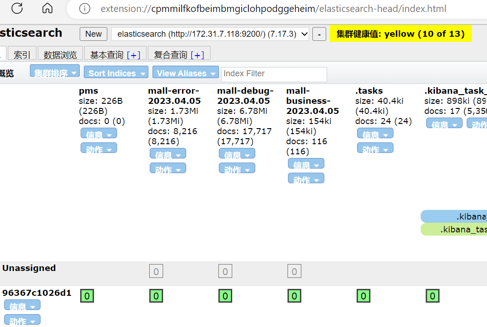

### 1.2.3 logsatsh初始化
* 旧版本需要安装 json_lines 插件，并重新启动，新版本已内置无需安装
```bash
## 进入logstash容器
root@mall-middleware:/mydata/elasticsearch/plugins# cd
root@mall-middleware:~# docker exec -it logstash /bin/bash
## 验证插件安装
logstash@a49fa5ad3785:~$ logstash-plugin list | grep logstash-codec-json_lines
OpenJDK 64-Bit Server VM warning: Option UseConcMarkSweepGC was deprecated in version 9.0 and will likely be removed in a future release.
logstash-codec-json_lines
logstash@a49fa5ad3785:~$ exit
exit
```
### 1.2.4 rabbitmq初始化
* 1.默认登录账户及密码为 guest
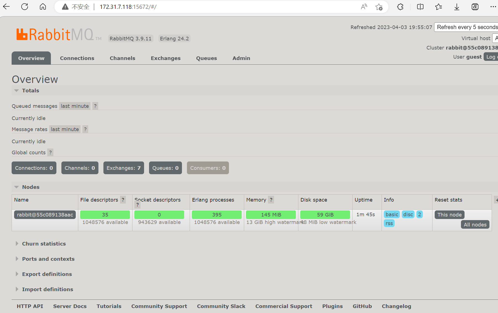
* 2.创建 mall 用户
  * mall 用户密码为 mall，权限为 admin
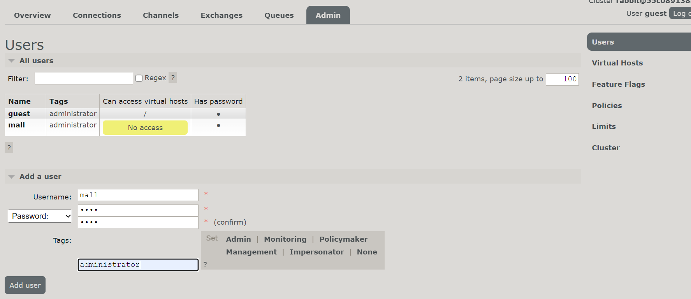
* 3.创建一个新的虚拟 vhost 名称为/mall
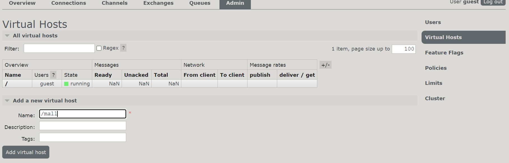
* 4.授予 mall 用户读写 vhost 权限
  * 授权vhosts
  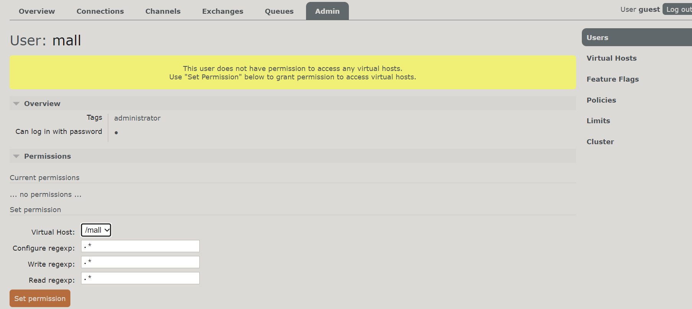
  * 验证权限
  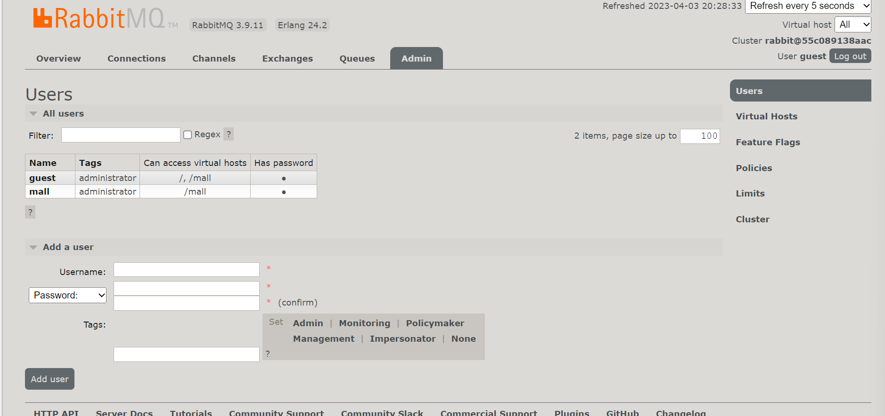
### 1.2.5 minio初始化
* 已配置默认使用的 USER 与 PASSWORD 均为 minioadmin
```bash
environment:
- "MINIO_ROOT_USER=minioadmin"
- "MINIO_ROOT_PASSWORD=minioadmin"
```
* 创建存储桶名称为 mall
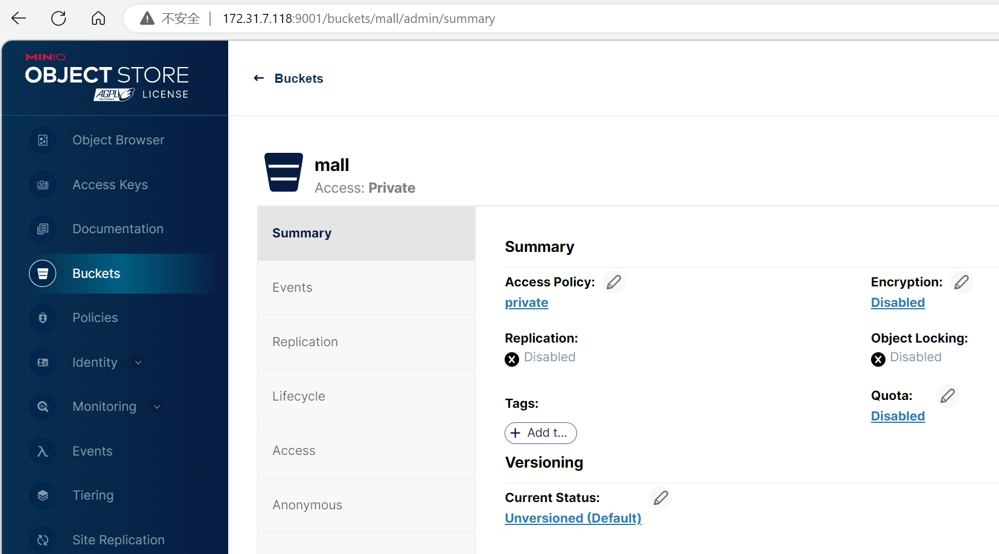
### 1.2.6 nacos初始化
* 登录nacos
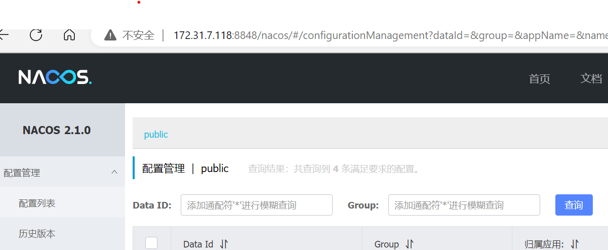
* 允许 prometheus 收集 caocs 指标数据
```bash
## 进入nacos容器
root@mall-middleware:~/middware# docker exec -it nacos-registry bash
## 修改配置文件
[root@63a765cfa9f1 nacos]#  vim /home/nacos/conf/application.properties
 47 management.endpoints.web.exposure.include=*
## 重启nacos
root@mall-middleware:~/middware# docker restart nacos-registry
nacos-registry
## 配置prometheus抓取nacos数据
root@k8s-master:~# vi ~/cloud_learn/k8s/k8s_prom/prometheus/prometheus-cfg.yml
  - job_name: "nacos"
    metrics_path: '/nacos/actuator/prometheus'
    static_configs:
      - targets:
        - 172.31.7.118:8848
        labels:
          project_name: "nacos"
## 重启prometheus
root@k8s-master:~# k apply -f ~/cloud_learn/k8s/k8s_prom/prometheus/
```
* prometheus 查看nacos target
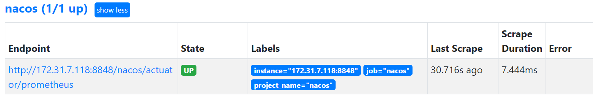

### 1.2.7 重启所有服务并验证无异常
```bash
## 重启中间件所有服务
root@mall-middleware:~/middware# docker compose restart
## 查看所有服务
root@mall-middleware:~/middware# docker compose ps
```
# 2. 修改 mall-swarm 项目配置文件中的中间件地址为当前环境的地址
## 2.1 修改配置文件 
* mall-swarm使用nacos作为配置中心，只需要修改导入nacos配置文件
```bash
## 批量替换配置文件
root@mall-middleware:~# cd mall/mall-swarm/config/
root@mall-middleware:~/mall/mall-swarm/config# sed -e 's/db:3306/172.31.7.118:3306/g' -e 's/192.168.3.101:9090/172.31.7.118:9090/g' -e 's/host: logstash/host: 172.31.7.118/g' -e 's/host: redis/host: 172.31.7.118/g' -e 's/host: mongo/host: 172.31.7.118/g' -e 's/host: rabbit/host: 172.31.7.118/g' -e 's/uris: es:9200/uris: 172.31.7.118:9200/g' -e 's/mall-gateway:8201/mall-gateway-service:8201/g' -i admin/mall-admin-prod.yaml gateway/mall-gateway-prod.yaml portal/mall-portal-prod.yaml search/mall-search-prod.yaml
```
## 2.2 将配置文件添加到Nacos中
* 添加后台管理配置
点+号即可增加配置，配置格式为yaml。
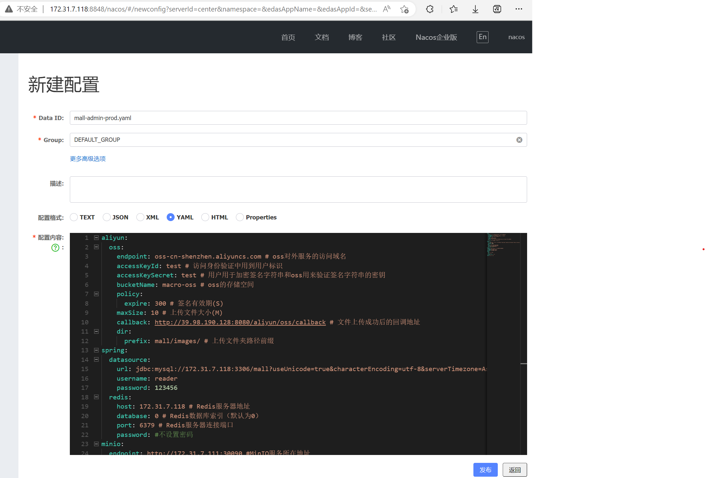
千万要注意，这里的jdbc:mysql://db:3306/mall?useUnicode=true&characterEncoding=utf-8&useSSL=false&serverTimezone=GMT%2B8，db需要修改为mysql的ip地址，否则k8s启动会报错。
k logs $container_name -f可以看到报错：2023-04-05 15:01:24.145 ERROR 1 --- [eate-1233595751] com.alibaba.druid.pool.DruidDataSource   : create connection SQLException, url: jdbc:mysql://localhost:3306/mall?useUnicode=true&characterEncoding=utf-8&serverTimezone=Asia/Shanghai, errorCode 0, state 08S01
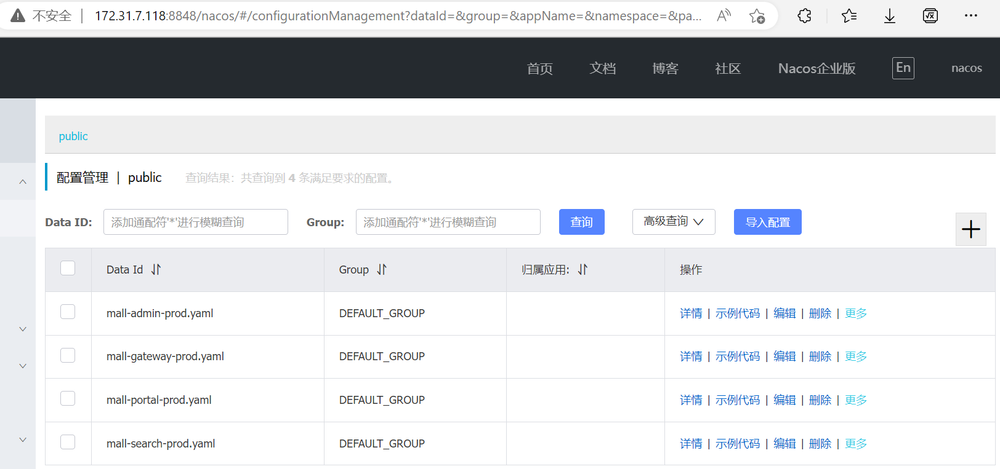
# 3. 基于 maven+JDK 1.8 编译 mall-swarm 项目
## 3.1 构建镜像开启 docker 的远程 API
```bash
## 复用原来的mall项目
## 构建镜像开启 docker 的远程 API
root@server:~/mall/mall-swarm# vi pom.xml
<docker.host>http://172.31.7.109:2375</docker.host>
## docker开启远程构建api,路径可能是/etc/, 也可能是/usr/lib/systemd/system/, 根据自己的实际情况修改。
root@server:~/mall/mall-swarm# vi /usr/lib/systemd/system/docker.service
ExecStart=/opt/kube/bin/dockerd -H unix:///var/run/docker.sock -H tcp://0.0.0.0:2375
## 重启docker
root@server:~/mall/mall-swarm# systemctl daemon-reload
root@server:~/mall/mall-swarm# systemctl restart docker
## 查看监听端口
root@server:~/mall/mall-swarm# ss -tnlp | grep 2375
LISTEN 0      4096               *:2375             *:*    users:(("dockerd",pid=2670,fd=9))
```
## 3.2 执行代码编译及镜像构建
```bash
## 安装jdk8, 加-y参数表示跳过系统提示, 直接安装
root@server:~/mall/mall-swarm# apt install openjdk-8-jdk -y
## 验证jdk8安装
root@server:~/mall/mall-swarm# java -version
openjdk version "1.8.0_362"
OpenJDK Runtime Environment (build 1.8.0_362-8u362-ga-0ubuntu1~22.04-b09)
OpenJDK 64-Bit Server VM (build 25.362-b09, mixed mode)
## 下载maven安装包
root@server:~/mall/mall-swarm# cd /apps/
root@server:/apps# wget https://mirrors.ustc.edu.cn/apache/maven/maven-3/3.6.3/binaries/apache-maven-3.6.3-bin.tar.gz
## 解压压缩包
root@server:/apps# tar xf apache-maven-3.6.3-bin.tar.gz
## 为maven创建软连
root@server:/apps# ln -sv /apps/apache-maven-3.6.3 /apps/maven
## 配置环境变量
root@server:/apps# vim /etc/profile
export PATH=/apps/maven/bin/:$PATH
## 生效环境变量
root@server:/apps# source /etc/profile
## 执行mvn命令验证安装
root@server:/apps# mvn --version
## 登录docker, 否则无法下载镜像
root@server:/apps# docker login
## 下载java镜像
root@server:/apps# docker pull java:8
## 执行镜像构建
root@server:/apps# cd /root/mall/mall-swarm/
root@server:~/mall/mall-swarm# mvn clean install package -Dmaven.test.skip=true
[INFO] ------------------------------------------------------------------------
[INFO] Reactor Summary for mall-swarm 1.0-SNAPSHOT:
[INFO] 
[INFO] mall-swarm ......................................... SUCCESS [  0.210 s]
[INFO] mall-common ........................................ SUCCESS [  5.399 s]
[INFO] mall-mbg ........................................... SUCCESS [  7.405 s]
[INFO] mall-demo .......................................... SUCCESS [  2.768 s]
[INFO] mall-admin ......................................... SUCCESS [ 10.882 s]
[INFO] mall-search ........................................ SUCCESS [  7.576 s]
[INFO] mall-portal ........................................ SUCCESS [  6.377 s]
[INFO] mall-monitor ....................................... SUCCESS [  3.692 s]
[INFO] mall-gateway ....................................... SUCCESS [  4.829 s]
[INFO] mall-auth .......................................... SUCCESS [  4.729 s]
[INFO] ------------------------------------------------------------------------
[INFO] BUILD SUCCESS
```
## 3.3 将镜像上传到镜像仓库
```bash
## 编写一个批量上传镜像的脚本
root@server:~# vi mall-swarm-push-image.sh
#!/bin/bash
images=`docker image ls| grep mall| awk '{print $1":"$2}'`
for i in $images;do
    old_image="$i"
    new_image="harbor.linuxarchitect.io/mall-swarm/"`echo "$old_image"|awk -F'/' '{print $2}'`
    echo "docker tag $old_image $new_image"
    docker tag $old_image $new_image
    echo "docker push $new_image"
    docker push $new_image
done
## 执行脚本
root@server:~# sh mall-swarm-push-image.sh
```

# 4. 在 k8s 运行 mall-swarm 项目
## 4.1 部署mall-swarm 项目
```bash
## 替换镜像地址
root@server:~# cd mall/mall-swarm/document/k8s/
root@server:~/mall/mall-swarm/document/k8s# sed -e 's/image: macrodocker/image: harbor.yanggc.cn\/magedu/g' -i *-deployment.yaml
## 验证镜像替换
root@server:~/mall/mall-swarm/document/k8s#  grep "image:" ./* -R
./mall-admin-deployment.yaml:          image: harbor.linuxarchitect.io/mall-swarm/mall-admin:1.0-SNAPSHOT
./mall-auth-deployment.yaml:          image: harbor.linuxarchitect.io/mall-swarm/mall-auth:1.0-SNAPSHOT
./mall-gateway-deployment.yaml:          image: harbor.linuxarchitect.io/mall-swarm/mall-gateway:1.0-SNAPSHOT
./mall-monitor-deployment.yaml:          image: harbor.linuxarchitect.io/mall-swarm/mall-monitor:1.0-SNAPSHOT
./mall-portal-deployment.yaml:          image: harbor.linuxarchitect.io/mall-swarm/mall-portal:1.0-SNAPSHOT
./mall-search-deployment.yaml:          image: harbor.linuxarchitect.io/mall-swarm/mall-search:1.0-SNAPSHOT
## 替换nacos服务发现地址
root@server:~/mall/mall-swarm/document/k8s# sed -e 's/192.168.3.101/172.31.7.118/g' -i *-deployment.yaml
## 验证替换, 其中-B 1表示看上一行
root@server:~/mall/mall-swarm/document/k8s# grep -R '172.31.7.118' . -B 1
root@server:~/mall/mall-swarm/document/k8s# scp *-deployment.yaml root@k8s-master01:/root/k8s/
## 部署mall-swarm服务
root@k8s-master01:~/k8s# alias k="kubecolor"
root@k8s-master01:~/k8s# k apply -f .
## 查看部署资源
root@k8s-master01:~/k8s# k get po,svc -o wide
NAME                                           READY   STATUS    RESTARTS   AGE   IP            NODE         NOMINATED NODE   READINESS GATES
pod/mall-admin-deployment-695b9b6b55-vhqch     1/1     Running   0          45m   10.244.1.57   k8s-node01   <none>           <none>
pod/mall-auth-deployment-86744d57db-m8mcn      1/1     Running   0          47m   10.244.1.55   k8s-node01   <none>           <none>
pod/mall-gateway-deployment-6984459d-dh4cl     1/1     Running   0          47m   10.244.1.56   k8s-node01   <none>           <none>
pod/mall-monitor-deployment-6bd95944d5-cgwjb   1/1     Running   0          47m   10.244.3.59   k8s-node03   <none>           <none>
pod/mall-portal-deployment-66c674bf8-wg874     1/1     Running   0          47m   10.244.3.61   k8s-node03   <none>           <none>
pod/mall-search-deployment-b7d887bc4-z8p5t     1/1     Running   0          47m   10.244.3.60   k8s-node03   <none>           <none>

NAME                           TYPE        CLUSTER-IP     EXTERNAL-IP   PORT(S)          AGE    SELECTOR
service/kubernetes             ClusterIP   172.31.5.1     <none>        443/TCP          14d    <none>
service/mall-admin-service     ClusterIP   172.31.5.145   <none>        8080/TCP         47m    app=mall-admin
service/mall-auth-service      ClusterIP   172.31.5.186   <none>        8401/TCP         47m    app=mall-auth
service/mall-gateway-service   NodePort    172.31.5.206   <none>        8201:30201/TCP   47m    app=mall-gateway
service/mall-monitor-service   NodePort    172.31.5.42    <none>        8101:30236/TCP   47m    app=mall-monitor
service/mall-portal-service    ClusterIP   172.31.5.235   <none>        8085/TCP         47m    app=mall-portal
service/mall-search-service    ClusterIP   172.31.5.183   <none>        8081/TCP         47m    app=mall-search
service/tomcat-service         NodePort    172.31.5.200   <none>        80:31080/TCP     7d5h   app=tomcat
```
## 4.2 访问 mall-monitor-service(Spring Boot Admin)
```bash
## 修改mall-monitor-service type为NodePort
root@server:~/k8s# vi mall-monitor-service.yaml
  type: NodePort # 从clusterIP改为NodePort
## 应用配置
root@server:~/k8s# k apply -f mall-monitor-service.yaml
## 查看service的端口信息, 30236为monitor service的NodePort端口
root@k8s-master01:~# k get svc
NAME                   TYPE        CLUSTER-IP     EXTERNAL-IP   PORT(S)          AGE
kubernetes             ClusterIP   172.31.5.1     <none>        443/TCP          14d
mall-admin-service     ClusterIP   172.31.5.145   <none>        8080/TCP         52m
mall-auth-service      ClusterIP   172.31.5.186   <none>        8401/TCP         52m
mall-gateway-service   NodePort    172.31.5.206   <none>        8201:30201/TCP   52m
mall-monitor-service   NodePort    172.31.5.42    <none>        8101:30236/TCP   52m
mall-portal-service    ClusterIP   172.31.5.235   <none>        8085/TCP         52m
mall-search-service    ClusterIP   172.31.5.183   <none>        8081/TCP         52m
tomcat-service         NodePort    172.31.5.200   <none>        80:31080/TCP     7d5h
## 查看mall-monitor的密码
root@server:~/k8s# cat /root/mall/mall-swarm/mall-monitor/src/main/resources/application.yml
    user:
      name: macro
      password: 123456
```
* mall-monitor查看应用信息

* mall-monitor查看应用墙
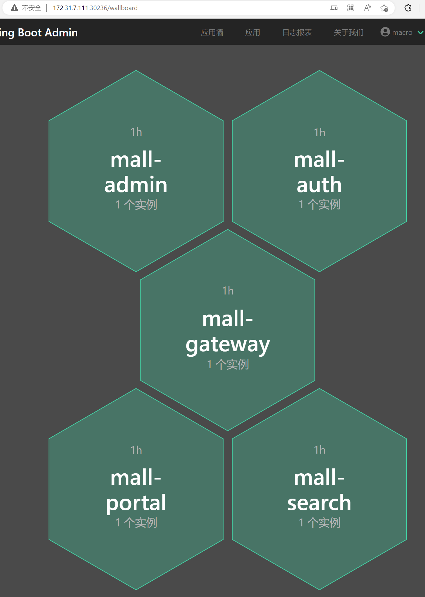
## 4.3 查看nacos服务列表
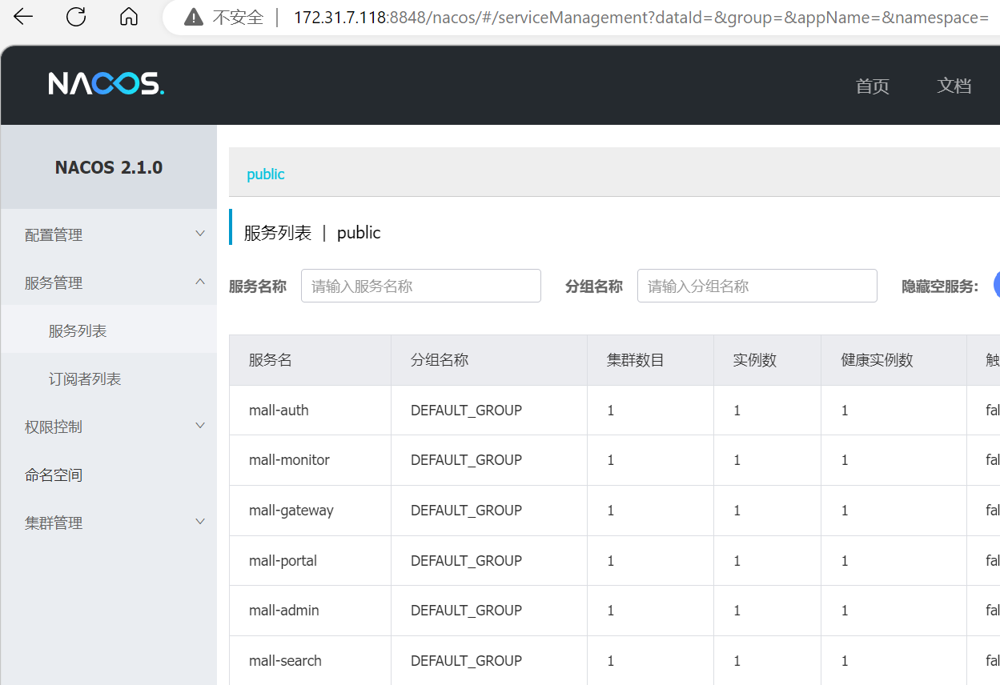
## 4.4 访问 mall-gateway-service
```bash
## 配置haproxy反向代理
root@server:~/mall/mall-swarm/document/k8s# cd
root@server:~# vi /etc/haproxy/haproxy.cfg
listen mall-80
        bind 172.31.7.109:80
        mode tcp
        #balance leastconn
        server 172.31.7.111  172.31.7.111:30201  check inter 2000 fall 3 rise 5
        server 172.31.7.112  172.31.7.112:30201  check inter 2000 fall 3 rise 5
        server 172.31.7.113  172.31.7.113:30201  check inter 2000 fall 3 rise 5
## 重启haproxy
root@server:~# systemctl restart haproxy.service
## windows宿主机配置C:\Windows\System32\drivers\etc\hosts
172.31.7.109 harbor.linuxarchitect.io
172.31.7.109 api.linuxarchitect.io

```
* 浏览器访问http://api.linuxarchitect.io/doc.html#/home
# 5. 编译前端服务 mall-admin-web
## 5.1 安装npm
```bash
## 下载nodejs 二进制压缩包
root@server:~# wget https://registry.npmmirror.com/-/binary/node/v12.14.0/node-v12.14.0-linux-x64.tar.gz
## 解压压缩包
root@server:~# cd /usr/local/src/
root@server:/usr/local/src# tar -xvf ~/node-v12.14.0-linux-x64.tar.gz
## node目录做一个软连
root@server:/usr/local/src# ln -s node-v12.14.0-linux-x64 node
## 配置环境变量
root@server:/usr/local/src# vim /etc/profile
export PATH=/usr/local/src/node/bin:$PATH
## 应用环境变量
root@server:/usr/local/src# source /etc/profile
## 测试node安装
root@server:/usr/local/src# npm version
{
  npm: '6.13.4',
  ares: '1.15.0',
  brotli: '1.0.7',
  cldr: '35.1',
  http_parser: '2.8.0',
  icu: '64.2',
  llhttp: '1.1.4',
  modules: '72',
  napi: '5',
  nghttp2: '1.39.2',
  node: '12.14.0',
  openssl: '1.1.1d',
  tz: '2019c',
  unicode: '12.1',
  uv: '1.33.1',
  v8: '7.7.299.13-node.16',
  zlib: '1.2.11'
}
root@server:/usr/local/src# node -v
v12.14.0
root@server:/usr/local/src# npx -v
6.13.4
```
## 5.2 clone 源代码并执行编译
```bash
## 克隆代码
root@server:~# git clone https://github.com/macrozheng/mall-admin-web.git
root@server:~# cd mall-admin-web/
## 修改前端监听地址,默认监听localhost,修改为0.0.0.0,可以让外部访问
root@server:~/mall-admin-web# vim config/index.js
 16     host: '0.0.0.0', // can be overwritten by process.env.HOST
 17     port: 8090, // can be overwritten by process.env.PORT, if port is in use, a free one will be determined
## 修改后端api地址为macrozheng的地址
root@server:~/mall-admin-web# vim config/dev.env.js
  7   BASE_API: '"https://admin-api.macrozheng.com"'
## 修改npm镜像源
root@server:~/mall-admin-web# npm config set registry https://registry.npm.taobao.org
## 验证镜像源配置
root@server:~/mall-admin-web# npm config list
; cli configs
metrics-registry = "https://registry.npm.taobao.org/"
scope = ""
user-agent = "npm/6.13.4 node/v12.14.0 linux x64"

; userconfig /root/.npmrc
registry = "https://registry.npm.taobao.org/"

; node bin location = /usr/local/src/node-v12.14.0-linux-x64/bin/node
; cwd = /root/mall-admin-web
; HOME = /root
; "npm config ls -l" to show all defaults.
## 安装python2.7
root@server:~/mall-admin-web# apt install python2.7 -y
root@server:~/mall-admin-web# ln -s /usr/bin/python2.7 /usr/bin/python2
## 安装npm的依赖包
root@server:~/mall-admin-web# npm install -g npm-install-peers
root@server:~/mall-admin-web# SASS_BINARY_SITE=https://npm.taobao.org/mirrors/node-sass/  npm install --unsafe-perm node-sass
root@server:~/mall-admin-web# npm install --unsafe-perm
```
## 5.3 运行测试环境
### 5.3.1 使用开源项目api
```bash
## 运行测试环境
root@server:~/mall-admin-web# npm run dev
 DONE  Compiled successfully in 9884ms                                  4:40:24 AM
 I  Your application is running here: http://0.0.0.0:8090

使用官方后端: 网页登录, 用户名admin, 密码macro123
```
* 访问mall-admin-web登录界面
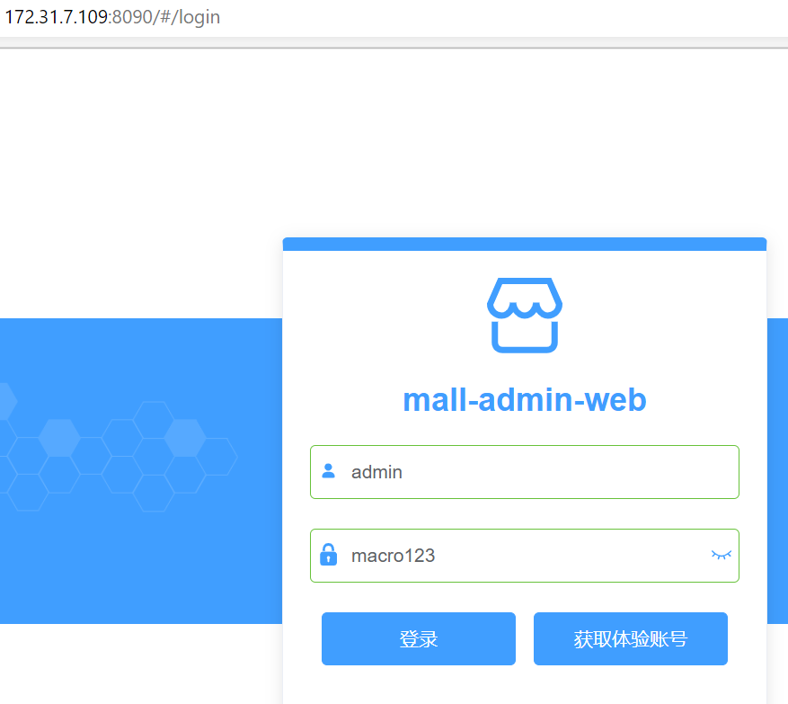